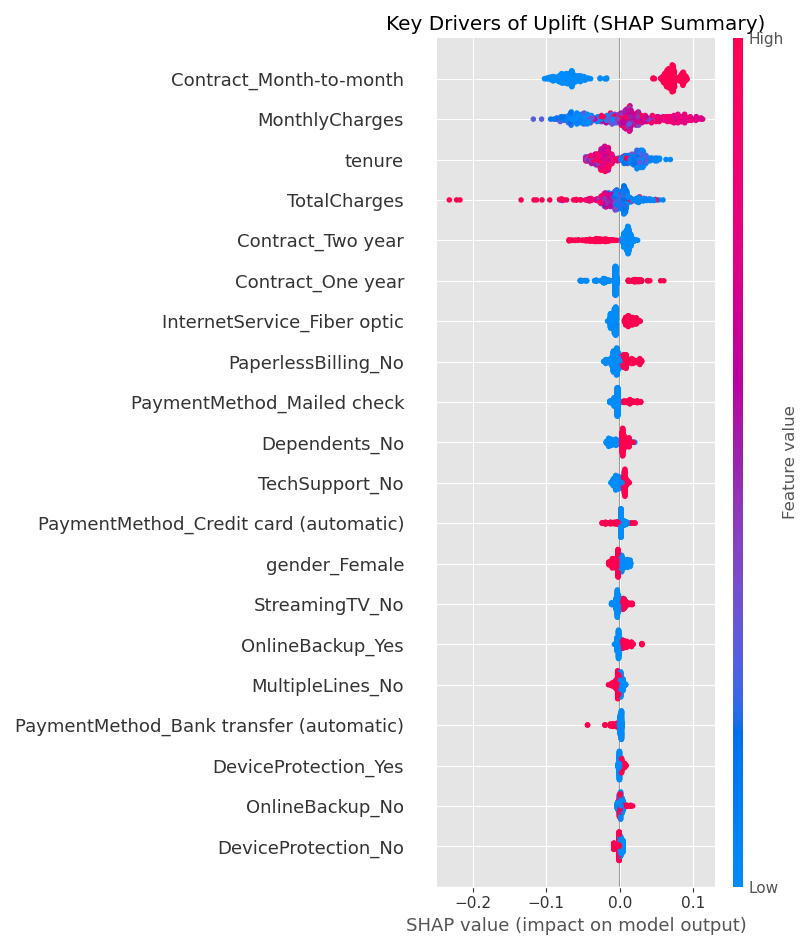
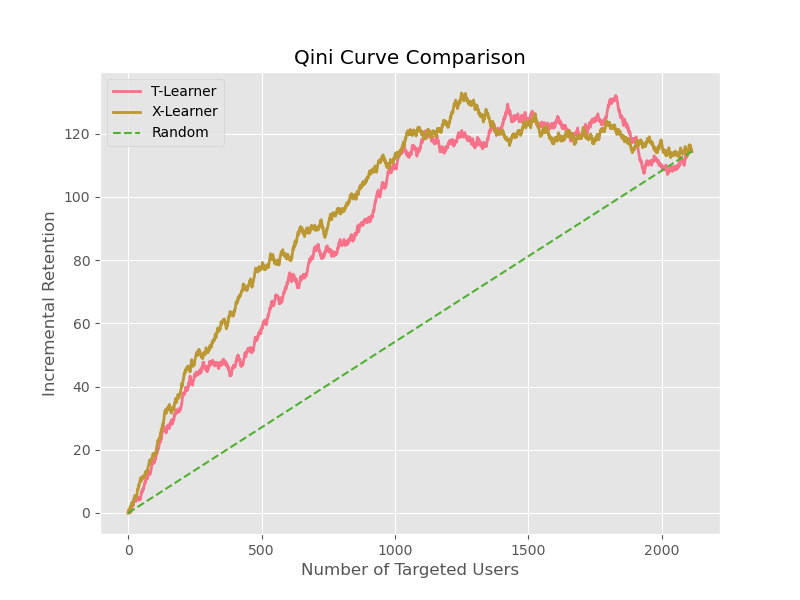

# Causal Uplift Modeling for Telco Churn Reduction 🚀


## 📖 Executive Summary
This project implements a **Heterogeneous Treatment Effect (HTE)** framework to optimize customer retention strategies. By simulating a Randomized Controlled Trial (RCT) environment, I developed an **X-Learner** meta-algorithm from scratch to identify "Persuadable" customers—those who are most likely to be retained *only if* they receive a treatment (e.g., a discount).

Unlike traditional churn prediction (which targets high-risk users regardless of intervention effect), this Uplift Model focuses on **incremental ROI**, achieving a **$10k+ expected profit increase** per 7,000 users compared to random targeting.

## 📊 Key Results & Visualizations

### 1. Business Impact: Profit Curve
The model identifies the optimal targeting threshold. By targeting the top **59%** of users based on Uplift Score, we maximize expected profit.


### 2. Model Interpretability: SHAP Analysis
Using SHAP values to interpret the CATE (Conditional Average Treatment Effect), we discovered that **Month-to-month contract** users with high tenure are the most responsive segment to retention offers.


### 3. Model Performance: Qini Curve
The X-Learner (Pink) significantly outperforms the T-Learner (Baseline) and Random selection, demonstrating superior ranking ability for uplift.


---

## 🛠️ Technical Implementation

### Core Components
* **Causal Inference Framework**: Implemented **X-Learner** and **T-Learner** meta-algorithms.
* **Base Learner**: Utilized **XGBoost Regressor** and **Classifier** for outcome prediction.
* **Evaluation Metrics**: AUUC (Area Under Uplift Curve), Qini Coefficient, and Decile Calibration.
* **Simulation**: Generated synthetic ground-truth uplift labels to validate model accuracy (Spearman Correlation: **0.87**).

### Code Structure
The `XLearner` class is implemented with a Scikit-Learn compatible API:
```python
class XLearner(BaseEstimator, RegressorMixin):
    def fit(self, X, y, t):
        # Stage 1: Base Outcome Models (Control vs Treatment)
        # Stage 2: Pseudo-Outcome Regression (Estimating CATE)
        ...
